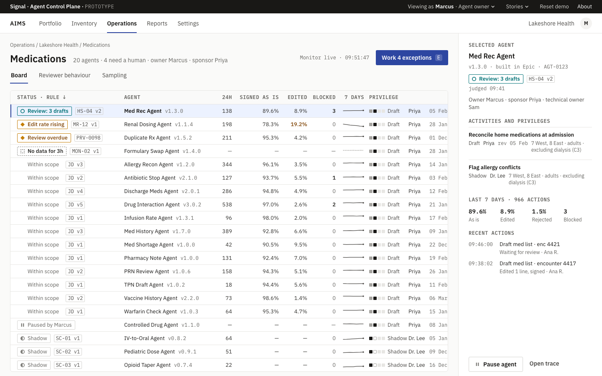
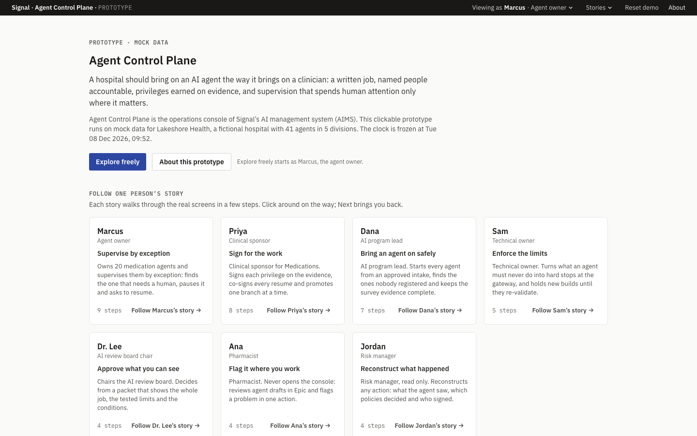
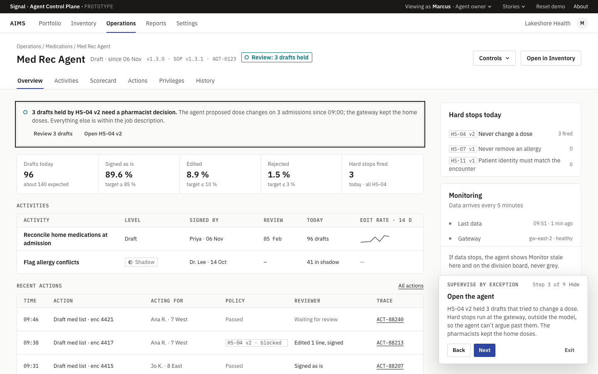
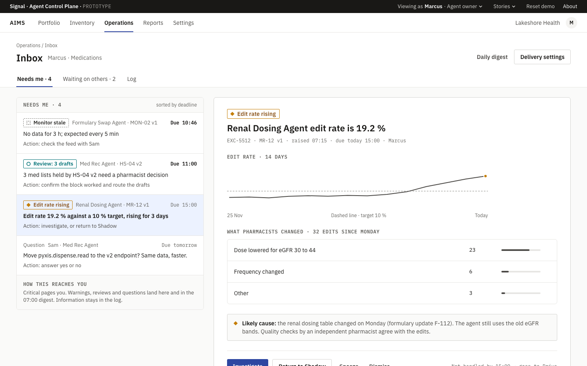
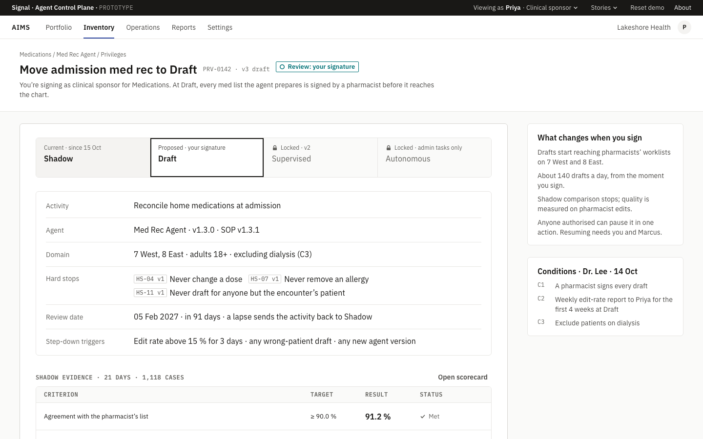
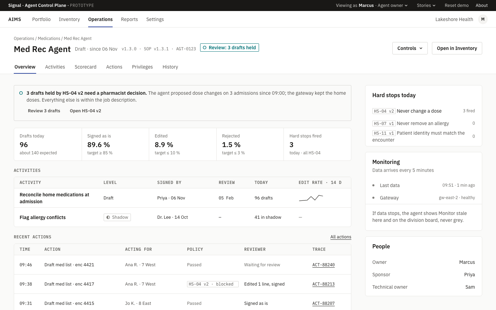
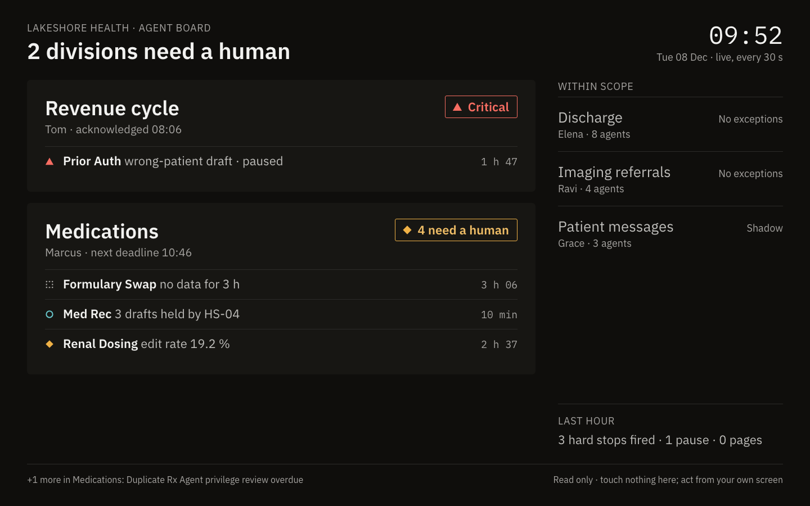

# Signal Agent Control Plane: clickable prototype

> A hospital should bring on an AI agent the way it brings on a clinician: a written job, named people accountable, privileges earned on evidence, and supervision that spends human attention only where it matters.

**Agent Control Plane** is the operations console of Signal's AI management system (AIMS) for hospitals. Named people onboard an agent, grant it staged privileges (Shadow → Draft → Supervised → Autonomous), supervise it by exception, stop it in one action and reconstruct anything it did for an auditor. This is a high-fidelity, front-end-only prototype built from the **Countersign** design system, running on mock data for a fictional hospital, Lakeshore Health.

**Try it: [agent-control-plane-mocha.vercel.app](https://agent-control-plane-mocha.vercel.app)** (desktop browser, 1024 px or wider)

- **Follow a story.** Pick one of seven people on the landing page and follow them through the real screens, step by step.
- **Explore freely.** Start as Marcus, the agent owner, and switch to anyone from the bar at the top. Locks, inboxes and landing pages change with the person.
- **Read [About](https://agent-control-plane-mocha.vercel.app/about)** for the problem, the principles and the design system.



## The people

| Person | Role | Story | What they do in the product |
|---|---|---|---|
| Marcus | Agent owner | Supervise by exception | Owns 20 medication agents and supervises them by exception: finds the one that needs a human, pauses it and asks to resume. |
| Priya | Clinical sponsor | Sign for the work | Clinical sponsor for Medications. Signs each privilege on the evidence, co-signs every resume and promotes one branch at a time. |
| Dana | AI program lead | Bring an agent on safely | AI program lead. Starts every agent from an approved intake, finds the ones nobody registered and keeps the survey evidence complete. |
| Sam | Technical owner | Enforce the limits | Technical owner. Turns what an agent must never do into hard stops at the gateway, and holds new builds until they re-validate. |
| Dr. Lee | AI review board chair | Approve what you can see | Chairs the AI review board. Decides from a packet that shows the whole job, the tested limits and the conditions. |
| Ana | Pharmacist | Flag it where you work | Pharmacist. Never opens the console: reviews agent drafts in Epic and flags a problem in one action. |
| Jordan | Risk manager | Reconstruct what happened | Risk manager, read only. Reconstructs any action: what the agent saw, which policies decided and who signed. |

## What's in it

- **All 55 designed frames** of epics E1–E15: onboarding and go-live, the command board and inbox, stop and resume, replay and audit, divisions and access, version changes and unregistered callers, clinician feedback from Epic, reviewer behaviour, survey evidence, review levels, promotion and automatic step-down.
- **Seven guided stories** with a narration panel; any step can be shared as a link.
- **A persona switcher with real permissions**: controls a person can't use render locked, with the reason.
- **A mock hospital that remembers what you do**: pause an agent and the board, the agent view and the inbox all agree. Reset demo puts it back.
- **A wall display** for a pharmacy or command centre, and the **Countersign component sheet** in light and dark.

| | |
|---|---|
|  |  |
|  |  |
|  |  |

## How it's built

- **Stack:** Vite, React 19, TypeScript (strict), React Router, Zustand, CSS Modules on Countersign's `--cs-*` tokens, IBM Plex Sans and Mono. No UI or icon library.
- **Three layers:** `src/design-system` (tokens and primitives, no hospital knowledge) → `src/components` (the ten Countersign product components: props in, callbacks out) → `src/features` (screens that read through selectors and change data only through store actions).
- **The mock hospital** is one versioned Zustand store with named scenarios (moments in time such as "resume requested" or "nine days later"). Every change goes through `can()` for permissions and writes the audit log, so any action can be traced back.
- **The story engine** (`src/prototype/stories`) keeps `?story=&step=` in the URL, loads the moment each step needs, and keeps what the visitor did between steps.
- **Tests:** 749 unit tests (Vitest and Testing Library) and 247 end-to-end tests (Playwright), including every route, every story from a shared link, keyboard paths, and an axe accessibility check (WCAG 2.1 AA) on every screen. `pnpm capture` screenshots each frame beside its design for visual QA.

## Run it locally

Node 24 and pnpm.

```bash
pnpm install
pnpm dev          # http://localhost:5173
pnpm check        # typecheck, lint, unit tests, build
pnpm e2e          # Playwright end-to-end tests
pnpm designs      # the design frames on http://localhost:4599
pnpm capture      # README screenshots and the social image (QA=1 also writes frame pairs)
```

## Docs

- [Build plan](docs/BUILD_PLAN.md): phases, checkpoints, frame tracker, decisions
- [Design spec](docs/specs/2026-10-08-agent-control-plane-prototype-design.md): scope, visitor experience, architecture, routes, data model
- [Design handoff](docs/design-handoff.md): Countersign tokens, primitives, the 10 product components, interaction rules
- [Phase plans](docs/plans/phase-9-polish.md): each phase's step-by-step plan, ending with this one
- [`designs/`](designs/): the high-fidelity frames for epics E1–E15

## About the names

Signal, Lakeshore Health and every person here are fictional, and all data is mock. The Epic screens are a neutral stand-in, not Epic's interface; only the panel on the right belongs to the product.

Built phase by phase from a written spec with Claude Code; every phase was a reviewed pull request.

By [StefanNav](https://github.com/StefanNav).
